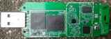
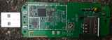
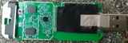
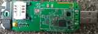
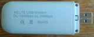

*[`README.md`](README.md) last updated on: 2022-10-18.*

[](img/logo.png) [](img/uf896/00_-_topside.jpg)

# HandsomeMod router operating system for "OpenStick" UF896.

This repository is a fork of the ["`uf896`"-branch](https://github.com/kirdesde/Handsomemod/tree/uf896) of "[kirdesde/Handsomemod](https://github.com/kirdesde/Handsomemod/)", which itself is based on "[HandsomeMod/HandsomeMod](https://github.com/HandsomeMod/HandsomeMod/)".

It is an operating system based on [OpenWrt](http://openwrt.org/), but with many changes and additions.

As "[kirdesde/Handsomemod](https://github.com/kirdesde/Handsomemod/)", this repository too is especially targeted at supporting the UF896 LTE/WiFi routers which come in the form factor of an USB stick. A discussion about this devices with links to further projects can be found [here on the OpenWrt forum](https://forum.openwrt.org/t/131712).

The purpose of this repository is to have a place for my modifications and fixes I apply for the UF896 support.

<details><summary>Photographs (*click* to open):</summary>

[](img/uf896/00_-_topside.jpg) [](img/uf896/01_-_PCB_SoCside.jpg) [](img/uf896/02_-_PCB_SIMside.jpg) [](img/uf896/03_-_PCB_SoCside-with-antenna-and-heatsink-attached.jpg) [](img/uf896/04_-_PCB_SIMside-with-antenna-attached.jpg) [](img/uf896/05_-_bottomside.jpg) [](img/uf896/06_-_cover_open_typesticker.jpg)
</details>

It is based on [OpenWrt 21.02](https://openwrt.org/releases/21.02/) and heavily modified. It uses a [Linux kernel](https://kernel.org/) version 5.10.33.

## Building

In general, the [building instructions from the OpenWrt project](https://openwrt.org/docs/guide-developer/toolchain/use-buildsystem) apply, but different repositories are used.

To build the firmware for the UF896 from this repository, use the following steps:

1. Make sure you have the [OpenWrt build requirements](https://openwrt.org/docs/guide-developer/toolchain/install-buildsystem) fulfilled.  
   *On [Arch Linux](http://archlinux.org) and Arch based distributions, installing the [AUR package "`openwrt-devel`"](https://aur.archlinux.org/packages/openwrt-devel) does pull in all needed dependencies.*
2. Clone this repository: `git clone https://github.com/dreirund/Handsomemod-uf896.git`.
3. `cd` into the clone: `cd Handsomemod-uf896`.
4. Generate `feeds.conf` from the default: `cp feeds.conf.default feeds.conf`.
5. Make sure that in the `feeds.conf` the following feeds are enabled *(note that the "`packages`" feed comes from HandsomeMod and* not *from OpenWrt, and also note the extra "`handsomefeed`" feed)*:  
   ```
   src-git packages https://github.com/HandsomeMod/packages.git
   src-git luci https://git.openwrt.org/project/luci.git;openwrt-21.02
   src-git routing https://git.openwrt.org/feed/routing.git;openwrt-21.02
   src-git telephony https://git.openwrt.org/feed/telephony.git;openwrt-21.02
   src-git handsomefeed https://github.com/HandsomeMod/handsomefeed.git
   ```  
   *(Other feeds might be available as well.)*
6. Install packages from the feeds: `./scripts/feeds update -a && ./scripts/feeds install -a`.
7. Select the default configuration for the `UF896`:  
   1. `make menuconfig`,
   2. Select the following options:
      1. `Target System`: `Qualcomm Msm89xx Soc` (`CONFIG_TARGET_msm89xx=y`),
      2. `Subtarget`: `Msm8916 Soc based Targets` (`CONFIG_TARGET_msm89xx_msm8916=y`),
      3. `Target Profile`: `Openstick UF896` (`CONFIG_TARGET_msm89xx_msm8916_DEVICE_openstick_uf896=y`),
      4. Select `Save` and then `Exit` the configuration (*do not* do further configurations now).
   3. Generate default configuration for the selected target: `make defconfig`.
8. If you want, configure options to your liking now: `make menuconfig`.
9. Build the firmware image: `make`.

For more build options and troubleshooting, refer to the [OpenWrt build system usage](https://openwrt.org/docs/guide-developer/toolchain/use-buildsystem) and other [documentation at OpenWrt.org](https://openwrt.org/docs/).

## Installing

*(Instructions taken from [&rarr;&hairsp;here](https://github.com/kirdesde/Handsomemod/commit/aec867af57f1212a5ec3c4dea2828463bc31ea29). Not guaranteed to work -- I myself am currently stuck at `fastboot erase rootfs` because my device does not has a partition with that name, see [&rarr;&hairsp;here](https://forum.openwrt.org/t/131712/92).)*

Carry out the following from a computer where the device is connected to via USB.

### Pre-cautions work:

1. Before conneting the device, make sure that there is currently no other device in fastboot mode connected, otherwise you can damage the other device:  
   `fastboot devices`  
   should return nothing.
2. Connect the device, and check that  
   `fastboot devices`  
   now returns something which looks similar to  
   ```
   0ec38c91 fastboot
   ```  
   (The ID can vary).

If that is given, proceed:

### Install instructions:

1. Erase boot partition:  
   `fastboot erase boot`
2. Write boot image:  
   `fastboot flash boot handsomemod-msm89xx-msm8916-openstick_uf896-squashfs-boot.img`
3. Erase rootfs partition:  
   `fastboot erase rootfs`
4. Write system image:  
   `fastboot flash rootfs handsomemod-msm89xx-msm8916-openstick_uf896-squashfs-system.img`
5. Reboot:  
   `fastboot reboot`
6. "OpenWrt" (HandsomeMod) should boot now (red led is blinking).
7. push the sysupgrade image to the device (this is imported, as this sets up the loop device for the rootfs overlay)  
   *(**Note:** `adbd` is part of the handsome feeds utils package, **Make sure you have `CONFIG_PACKAGE_android-tools-adbd=y`!**)*  
   `adb push handsomemod-msm89xx-msm8916-openstick_uf896-squashfs-sysupgrade.bin /tmp`
8. Execute sysupgrade:  
   `adb shell`  
   `sysupgrade /tmp/handsomemod-msm89xx-msm8916-openstick_uf896-squashfs-sysupgrade.bin`
9. After reboot you should have a working openwrt incl. overlay fs
10. Thanks to the usb gadget mode the device has ethernet connectivity over usb
11. Please note, it's also part of the handsome feeds utils to setup and activate a default wifi AP (unencrypted). You can disable this after the last reboot (or disable it in the build config)


## State of this repository

This is work in progress and might not work as expected. The main work to make this work has been carried out by the upstream projects "[kirdesde/Handsomemod](https://github.com/kirdesde/Handsomemod/)" and "[HandsomeMod/HandsomeMod](https://github.com/HandsomeMod/HandsomeMod/)", many thanks to them.

## License

HandsomeMod itself (i.e. the code that is directly provided by the HandsomeMod repositories) is licensed under [GPL-2.0](LICENSES/GPL-2.0).

Building a HandsomeMod firmware might pull in other, external software, which might have it's own licensing.

## Original upstream README

*[Here to the original `README.md`](README.handsomemod-upstream.md) from the [upstream repository](https://github.com/kirdesde/Handsomemod/), as of 2022-08.*
